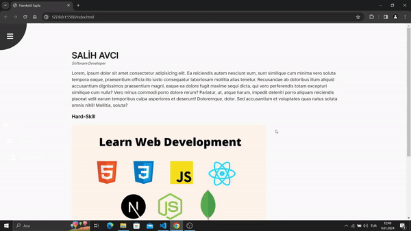

Tabii ki, emoji eklemek projenizi daha eğlenceli ve görsel açıdan çekici hale getirebilir. İşte emoji kullanarak güncellenmiş bir GitHub açıklama örneği:

---

# 🚀 Hareketli Sayfa

Bu proje, basit bir hareketli sayfa tasarımını içermektedir. Sayfa, bir daire içinde bulunan açılır menü ve kapatma düğmeleri ile birlikte kullanıcı dostu bir tasarıma sahiptir. Ayrıca, "SALİH AVCI" adlı bir başlık, "Software Developer" alt başlık ve geniş bir metin içeriği içermektedir.

## 🎨 Özellikler

- Açılır menü ve kapatma düğmeleri için FontAwesome ikonları kullanılmıştır.
- Sayfa içeriği, başlık, alt başlık ve açıklama paragrafları ile zenginleştirilmiştir.
- "Hard-Skill" başlığı altında bir görsel ve açıklama paragrafı bulunmaktadır.
- Navigasyon menüsü, FontAwesome ikonları ve metin içeren liste elemanları ile oluşturulmuştur.

## 📁 Dosyalar

- `index.html`: Temel HTML yapısını içeren dosya.
- `style.css`: Sayfanın görünümünü özelleştiren CSS dosyası.
- `app.js`: Sayfa üzerindeki etkileşimleri sağlamak için JavaScript dosyası.

## 📚 Kullanılan Kütüphane

- FontAwesome (v6.1.1): Sayfa üzerinde ikonları görüntülemek için kullanılmıştır.

## 🛠️ Kurulum

1. Projeyi klonlayın: `git clone https://github.com/kullanici_adiniz/proje_adiniz.git`
2. Tarayıcınızda `index.html` dosyasını açarak sayfayı görüntüleyin.

Bu proje, temel bir HTML, CSS ve JavaScript kullanımını içermektedir. İlgili dosyaları düzenleyerek kendi projenize uyarlayabilirsiniz.

## 🖼️ Ekran Görüntüsü

